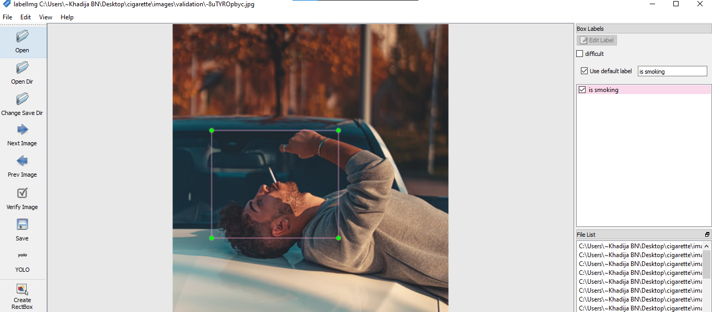

# Smoking-Detection-Using-YOLO-V5

## Steps :
1. Cloning repository for YoloV5
```
!git clone https://github.com/ultralytics/yolov5
```
2. Installing dependencies
```
pip install -r requirements.txt
```
3. Create annotations for a custom dataset Using the LabelImg tool



5. Creating YAML file for training

We specify:
- Our training and validation dataset directory location.
- The number of classes we want to detect.
- The name of our class

7. YoloV5 training
I used Google Colab GPU
```
!python train.py --img 640 --batch 12 --epochs 2 --data wheat.yaml --cfg models/yolov5s.yaml --name wm
```
9. YoloV5 Inference
```
!python detect.py --img 640 --source ../smallTest/ --weights runs/train/wm2/weights/best.pt --conf-thres 0.4
```
